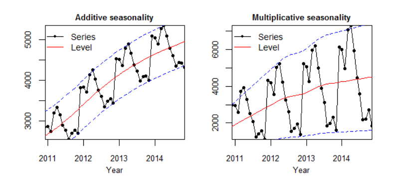
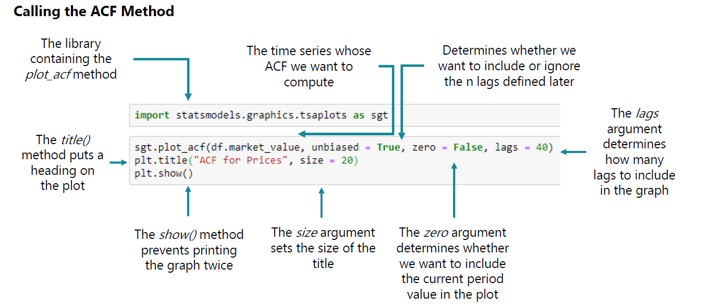
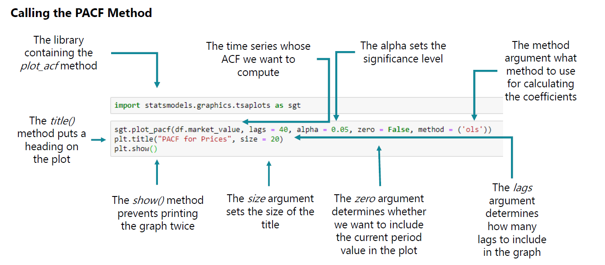
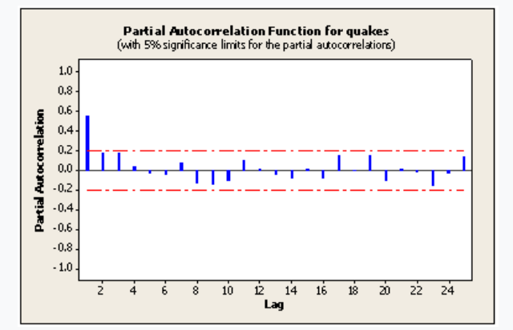
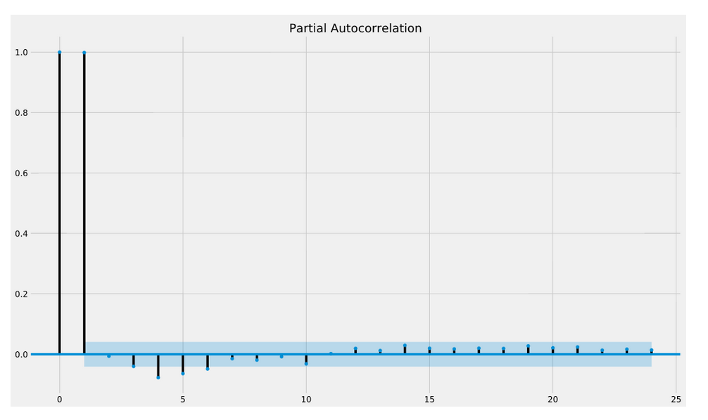
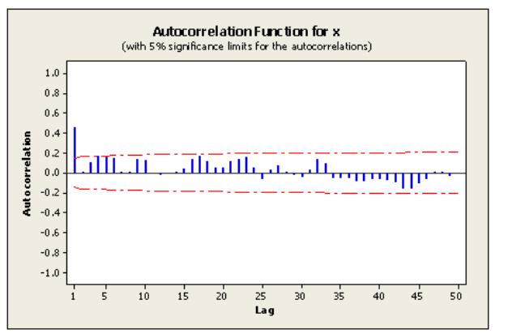

```{r setup, include=FALSE}
knitr::opts_chunk$set(echo = TRUE , message = FALSE , warning = FALSE , 
                      reticulate.repl.quiet = TRUE , error=TRUE)
```

**We pick up from where we left off in Chapter 1. In this Chapter we will cover key concepts of Time Series Analysis:**

1.  **Revisit Time Series Data Preparation (Transformation , Missing Value treatment , Splitting into Train and Test)**

2.  **White Noise Time Series**

3.  **Random Walk Time Series**

4.  **Stationarity**

5.  **Seasonality**

6.  **Autocorrelation**

7.  **Partial Autocorrelation**

***Credits : 365 Data Science Team "Time Series Analysis in Python 2021"***

# Data Preparation

Let us begin by preparing our Time Series data for analysis.
We will be analyzing the S&P Index values.

## Load Libraries

```{python  , results = FALSE , message = FALSE}
import pandas as pd 
import numpy as np 
import matplotlib.pyplot as plt 
import statsmodels.graphics.tsaplots as sgt 
import statsmodels.tsa.stattools as sts 
from statsmodels.tsa.seasonal import seasonal_decompose
import seaborn as sns
sns.set()
import warnings
warnings.filterwarnings('ignore')
```

## Load , Transform and Prepare Data for Modeling

```{python}
# load data and make a copy
raw_csv_data = pd.read_csv("index_2018.csv") 
df_comp=raw_csv_data.copy()
```

```{python}
# convert date column to datetime
df_comp.date = pd.to_datetime(df_comp.date, dayfirst = True)

# set the index as date
df_comp.set_index("date", inplace=True)

# set the frequency as daily by business days
df_comp=df_comp.asfreq('b')

# fill missing values using forward fill 
df_comp=df_comp.fillna(method='ffill')

# final view
df_comp.head()
```

```{python}
# create a column market value which has copies of S&P only
df_comp['market_value']=df_comp.spx

# deleted unwanted columns
del df_comp['spx']
del df_comp['dax']
del df_comp['ftse']
del df_comp['nikkei']

# final view
df_comp.head()
```

## Prepare Training and Testing Datasets

```{python}
# split into 80% train and 20% test
# create a variable with 80% size of the data
size = int(len(df_comp)*0.8)

# create the training and testing sets 
# we will keep the name df for the training set and df_test for test set
df, df_test = df_comp.iloc[:size], df_comp.iloc[size:]

# view the training and testing data sets
df.tail()
df_test.head()
```

# White Noise

## Introduction to White Noise

**White Noise is a special type of time series where the data doesn't follow a pattern**.Recall that one of the assumptions when we split our data into training and test sets i.e. the patterns found in the past also persist in the future.

In the case of White Noise since no pattern can be found, we can't predict white noise.

For a Time Series to be categorized as White Noise , it must satisfy these three conditions :

1.  A constant mean μ : Mean values are constant across intervals of the Time Series

2.  A constant variation σ2 : Variation is constant across intervals of the Time Series

3.  No Autocorrelation : There is no clear relationship between past and present values of a time series.

***To summarize : White noise is a sequence of random data where every value has a time period associated with it.It behaves sporadically, so there is no way to successfully project it into the future.***

In Financial Modeling, it is important to distinguish white noise data from regular time series data.We can easily tell the two apart by comparing their graphs.

We can generate white noise data and plot its values, then we can try plotting the graph of the S&P closing prices and compare the two.

## Creating a White Noise Time Series

Let us create a White Noise series and store the values in a variable called "wn".

To create WN , we can use np.random.normal() method of the Numpy package.
We want the White Noise sequence to be comparable to the S&P so we should set its mean and standard deviation to that of the actual set.

The random.normal method takes three arguments :

1.  loc (location) : this is the mean which in our case is the mean of market_value

2.  scale (spread) : this is the variation in the distribution in our case sd of the market value

3.  size (how many) : this is the number of values we want to generate in our case the size of the TS

```{python , results = FALSE}
np.random.seed(42)
# creating a White Noise TS based on the distribution of S&P Market value distribution
WN = (np.random.normal(loc = df.market_value.mean() , 
                      scale = df.market_value.std() , 
                      size = len(df)))
# add column WN to existing dataframe df
df['WN'] = WN
```

```{python}
# view the dataframe
df.head()
```

Let us look at the summary statistics of market_vale and WN

```{python}
# summary statistics
df.describe()
```

Mean & Standard Deviation of White Noise are similar but not exactly equal to that of S&P.The reason being , White Noise values we generated are normally distributed around the mean of the S&P.However, since each one is generated individually, the average does not have to end up being the same.

## Plotting White Noise

Let us plot the "White Noise"

```{python results = FALSE , message = FALSE , fig.width = 20 , fig.height = 6}
## create the line chart by extracting only the spx values
sns.lineplot(data = df.WN);
## add the title
plt.title("White-Noise-Time-Series" , size = 24);
## display the plot
plt.show()
```

We can see that there is no clear pattern.Let us plot both "White Noise" and "S&P"...

# Random Walk

## Introduction

A random walk is a special type of time series where values tend to persist over time and the differences between periods are white noise.

Suppose we express prices with P and residuals with ϵ then a Random Walk Time Series can be expressed as : Pt **=** Pt−1 **+** ϵt

.The underlying assumption is that the residuals are white noise, so they are arbitrary and cannot be predicted.\

This suggests that Best Estimates for prices today are the prices yesterday and Best estimates for Tomorrow's prices are today's prices.

To get a better idea of what a random walk process looks like, let us load some data and plot it against the S&P prices for comparison.We have a random walk dataset that we will plot against the S&P500.

## Generating Random Walk TS

We will load the given dataset , convert it to a Time Series by converting date column to datetime type , set the index of the dataframe as date and apply "frequency as Business Days"

```{python}
# load the random walk dataset
rw = pd.read_csv("rand_walk.csv")
print(rw.head())
print(rw.info())
```

```{python}
# convert date column to datetime type
rw.date = pd.to_datetime(rw.date, dayfirst = True)
rw.info()
```

```{python}
# reset index to date
rw.set_index("date", inplace = True)
rw.head()
```

```{python}
# define the frequency in this case business day
rw = rw.asfreq('b')
rw.head()
```

## Plotting the Random Walk against S&P

We will add the RW column to our existing S&P indices dataframe and plot both the Time Series together

```{python}
# add the rw values to existing dataframe df
df['rw'] = rw.price
df.head()
```

Let us create a dataframe without WN

```{python}
df_n_wn = df[['market_value' , 'rw']]
df_n_wn.head()
```

```{python pyplot, results = FALSE , message = FALSE , fig.width = 20 , fig.height = 6}
# plotting all the S&P and white random walk together
sns.lineplot(data = df_n_wn);
plt.show()
```

The two time series looks somewhat similar and both have small variations between consecutive time periods.

Both time series have cyclical increases and decreases in short periods of time.

# Stationarity

## Introduction

Technically speaking,time series stationary implies that taking consecutive samples of data with the same size should have identical covariance regardless of the starting point.
Covariance(S1) = Covariance(S2) where S1 and S2 are the time periods of observations of the same lengths.

Statistically speaking , a time series whose statistical properties, such as mean, variance, etc., remain constant over time, are called a stationary time series.Statistical properties of a Stationary Time Series are independent of the point in time when the observations are recorded.
More precisely, if {yt} is a **stationary** time series, then for all s, the distribution of (yt,...,yt+s) does not depend on t

In general, a stationary time series will have no predictable patterns in the long-term.

Time plots will show the series to be roughly horizontal , with constant variance <https://otexts.com/fpp2/stationarity.html>

## Covariance Stationarity (weak-form stationarity)

Covariance(S1) = Covariance(S2) where S1 and S2 are the time periods of observations of the same lengths

We can classify a time series as covariance stationary if it satisfies three key assumptions :

1.  Constant Mean $\mu$

2.  Constant Variance $\sigma^2$

3.  Covariance $\sigma^2$S1 = Covariance $\sigma^2$S2 i.e.
    Cov (x1 , x4) = Cov(x3 , x6)

Covariance between 1st and 4th period = Covariance between 3rd and 6th period

Distance between x1 and x4 = Distance between x3 and x6

An example of a Stationary Time Series is "White Noise" which has a constant mean and a constant variation.

Covariance = Correlation \* $\sigma$ we can say that correlation between time desired time periods = 0

## Detecting Stationarity (Augmented Dickey Fuller ADF Test)

The 20th century, statisticians David Dickey and Wayne Fuller developed a test to help all of us determine whether the Time Series Data comes from a stationary or non stationary process.

The *Augmented Dickey-Fuller* (ADF) test is a type of statistical test applied on the Time Series data to assess stationarity.

**Null Hypothesis (H0)** : Series is non-stationary {the one lag autocorrelation coefficient $\phi1$ \< 1}

**Alternate Hypothesis (HA)** : Series is stationary {the one lag autocorrelation coefficient $\phi1$ = 1}

**If Test Statistic \< Critical Value and p-value \< 0.05 -- *Reject Null Hypothesis(H0) i.e.,* time series data comes from a stationary process**

Let us conduct the ADF test on "market_value" , "white noise" and "random walk" data we have in our data set

The **statsmodels** package provides a reliable implementation of the ADF test via the **adfuller()** function in **statsmodels.tsa.stattools**.
It returns the following outputs:

1.  The p-value

2.  The value of the test statistic

3.  Number of lags considered for the test

4.  The critical value cut-offs.

When the test statistic is lower than the critical value shown, you reject H0 and infer that the time series is stationary.

Let us run the ADF test on market value

```{python}
sts.adfuller(df.market_value)
```

Let us create a small function to print out results in customized manner

```{python , results = FALSE}
# Function to print out results in customised manner
from statsmodels.tsa.stattools import adfuller
def adf_test(timeseries):
    print ('Results of Augmented-Dickey-Fuller Test:')
    adftest = adfuller(timeseries, autolag='AIC')
    adfoutput = pd.Series(adftest[0:4], index=['Test Statistic','p-value','#Lags Used','Number of Observations Used'])
    for key,value in adftest[4].items():
        adfoutput['Critical Value (%s)'%key] = value
    print (adfoutput)
```

Let us run the ADF Test on "market_vale" , "wn" and "rw"

```{python}
# Call the function and run the test on market value
adf_test(df['market_value'])
```

**Inference : Market Value comes from a "Non-Stationary Time Series"**

-   *The Test Statistic (-1.736) \> Critical Value (-2.862) \@ 5% significance level with a p-value of the test statistic (0.412) \> 5% significance level 0.05.*

-   *We reject the Null Hypothesis and conclude that the we do not have sufficient evidence that the S&P Index data comes from a "Stationary Time Series".There is a 41% chance of rejecting H0.*

-   *The number of lags is 18 implying that there are some autocorrelation going back 18 periods.*

Let us test if "White Noise Comes from a Stationary Time Series"

```{python}
# Call the function and run the test on white noise
adf_test(df['WN'])
```

**Inference : White Noise comes from Stationary Time Series**

-   *The Test Statistic (-71.977) \< Critical Value (-3.43) \@ 5% significance level with a p-value of the test statistic (\~0) \< 5% significance level 0.05.*

-   *We fail to reject the Null Hypothesis and conclude that the we have sufficient evidence that the White Noise data comes from a "Stationary Time Series".There is a 0% chance of not rejecting H0.*

```{python}
# Call the function and run the test on random walk
adf_test(df['rw'])
```

**Inference : Random Walk comes from a "Non-Stationary Time Series"**

-   *The Test Statistic (-1.3286) \> Critical Value (-2.862) \@ 5% significance level with a p-value of the test statistic (0.615) \>5% significance level 0.05.*

-   *We reject the Null Hypothesis and conclude that the we do not have sufficient evidence that the Random Walk data comes from a "Stationary Time Series".There is a 60% chance of rejecting H0*

# Seasonality

## Introduction

Seasonality occurs when Time Series data exhibits regular and predictable patterns at time intervals that are smaller than a year.
An example of a time series with seasonality is **retail sales**, which often increase between September to December and will decrease between January and February.Seasonality is quite common in economic time series but less common in engineering and scientific data.An increase in water consumption in summer due to warmer weather.

Seasonal effects are different from cyclical effects, as seasonal cycles are observed within one calendar year, while cyclical effects, such as boosted sales due to low unemployment rates, can span time periods shorter or longer than one calendar year.<https://www.investopedia.com/terms/s/seasonality.asp>

## Identifying Seasonality (Decomposition)

There are several ways of identifying Time Series for Seasonality.
One such method involves **Decomposing** the Time Series.
Decomposition procedures are used in time series to describe the trend and seasonal factors in a time series.More extensive decompositions might also include long-run cycles, holiday effects, day of week effects and so on.

One of the main objectives for a decomposition is to estimate seasonal effects that can be used to create and present seasonally adjusted values.
A seasonally adjusted value removes the seasonal effect from a value so that trends can be seen more clearly.
For instance, in many regions of the U.S. unemployment tends to decrease in the summer due to increased employment in agricultural areas.
Thus a drop in the unemployment rate in June compared to May doesn't necessarily indicate that there's a trend toward lower unemployment in the country.
To see whether there is a real trend, we should adjust for the fact that unemployment is always lower in June than in May.

One of the most common methods is to decompose the Time Series into Three Components :

**TREND** Tt : Trend is defined as the 'long term' movement in a time series without calendar related and irregular effects, and is a reflection of a pattern consistent throughout the data

**SEASONAL** St: A seasonal effect is a systematic and calendar related effect

**RESIDUAL** Rt : The error of prediction or the difference between the actual data and the model we fit.This is also the remainder component after we have decomposed into trend and seasonality

The simplest type of decomposition is called **naive** wherein we expect a linear relationship between the three parts and the observed Time Series.Furthermore we have two types of naive decompositions :

**Additive** $x_t$ **= Trend + Seasonal + Residual**... Additive assumes that for any time period, the observed value is the sum of the trend, seasonal and residual for that period.The additive model is useful when the seasonal variation is relatively constant over time.

**Multiplicative** $x_t$ **= Trend \* Seasonal \* Residual**...The multiplicative decomposition assumes the original series is a product of the trend,seasonal and residual values.The multiplicative model is useful when the seasonal variation increases over time.When the variation in the seasonal pattern, or the variation around the trend-cycle, appears to be proportional to the level of the time series, then a multiplicative decomposition is more appropriate.
Multiplicative decompositions are common with economic time series.

Look at the plot below where in the case of "Additive Seasonality" the amplitude of the seasonal variation is independent of the level, and in the case of "Multiplicative Seasonality , seasonal variation and level are connected i.e. seasonal variations are becoming "wider".<https://kourentzes.com/forecasting/2014/11/09/additive-and-multiplicative-seasonality/>

blue dotted lines : variation in magnitude / amplitude

red solid line : trend component

{width="502"}

## Seasonal Decomposition (statsmodels)

The **stats models** package includes a method called **seasonal_decompose** that takes a Time Series and splits it up into the three parts.

seasonal_decompose(df.ts, model = "xyz") : ts is the Time Series , model is either additive or multiplicative

First, we store the output of the seasonal_decompose method in a variable s_dec.

Second , we apply the .plot() method on the variable which will render a graphical visualization of the decomposition

```{python , results = FALSE , message = FALSE , fig.width = 20 , fig.height = 15}
# import seasonal decompose from statsmodel
from statsmodels.tsa.seasonal import seasonal_decompose
import matplotlib.pyplot as plt

# additive decomposition
s_dec_add = seasonal_decompose(df.market_value , model = "additive")

# plot the results
s_dec_add.plot()
plt.show()
```

The 1st plot is the Observed Time Series without decomposition i.e.
Actual Time Series

The 2nd plot is Trend Component of the Time Series.
The trend closely resembles the observed series, that's because the decomposition function uses the previous period values as a trendsetter.The trend part of the decomposition explains most of the variability of the data

The 3rd plot is Seasonal Component of the Time Series , which looks like a rectangle..This happens when the values are constantly oscillating and the figure size is too small.In our case, the linear change results from constantly switching up and down between (-0.2) and (+0.1) for every period.Therefore, there is no concrete cyclical pattern determined by using naive decomposition.

The 4th plot is the Residual / Error / Random Component of the Time Series , which is the difference between true values and predictions for any time period.The residuals vary greatly around the turn of the century (2000 : dot-com bust) and around 2008 (housing prices bubble), which explains the instability in the Time Series..

**Inference : The results of the additive decomposition suggest no seasonality in the data**

```{python , results = FALSE , message = FALSE , fig.width = 20 , fig.height = 15}
# import seasonal decompose from statsmodel
from statsmodels.tsa.seasonal import seasonal_decompose
import matplotlib.pyplot as plt

# additive decomposition
s_dec_add = seasonal_decompose(df.market_value , model = "multiplicative")

# plot the results
s_dec_add.plot()
plt.show()
```

**Inference : The seasonal sequence has no clear pattern , and the trend closely resembles the observed series**

**Examining the "Additive" and "Multiplicative Decomposition" we have proof there is no seasonality among S&P prices**

# Autocorrelation

## Introduction

We know that we avoid shuffling time series data because we want to preserve the chronological order of the set to discover links between past and present values within the Time Series.

We are interested in the relationship between the entries for consecutive periods, T and T-1.

Correlation : $\rho$ (x,y) measures the similarity in the change of values of two series x and y.
In the case of Time Series data we have a single variable.
To calculate the similarity in the change through time for a single series we introduce the concept of ***Autocorrelation***.
Autocorrelation measures the correlation between the sequence and itself to be more precise , it measures the level of resemblance between a sequence from several periods ago and the actual data.

Just as correlation measures the extent of a linear relationship between two variables, autocorrelation measures the linear relationship between *lagged values* of a time series.

Mathematically speaking , autocorrelation is a representation of the degree of similarity between a **given time series** and a **lagged version** of itself over successive time intervals.
It's conceptually similar to the correlation between two different time series, but autocorrelation uses the same time series twice: once in its original form and once lagged one or more time periods. 

For example, if it's rainy today, the data suggests that it's more likely to rain tomorrow than if it's clear today.
When it comes to investing, a stock might have a strong positive autocorrelation of returns, suggesting that if it's "up" today, it's more likely to be up tomorrow, too.

If we find the autocorrelation for a Time series with Daily Frequency, we're determining how much of yesterday's values resemble today's values.If the frequency is instead annual, autocorrelation will measure the similarities from year to year.

## Autocorrelation Function (ACF)

In Time series analysis, it is vital to compute and compare autocorrelation values between different lag's.To do so, we need to introduce the auto correlation function or ACF for short.The ACF computes the autocorrelation value for the number of lag's we are interested in simultaneously.

$\rho$ (Xt , Xt-1) --- Autocorrelation with 1 Lag

$\rho$ (Xt , Xt-2) --- Autocorrelation with 2 Lags

$\rho$ (Xt , Xt-3) --- Autocorrelation with 2 Lags

The stats model's graphics, TSA plots package contains a method plot_acf() for plotting the auto correlation function.The various parameters of the plot_acf() are illustrated below

{width="527"}

**Let us visualize the ACF plot of the S&P index values over 40 lags**

```{python}
# import the time series graphics package
import statsmodels.graphics.tsaplots as sgt

# plot the ACF (correlogram) over 40 lags
sgt.plot_acf(df.market_value, lags = 40, zero = False)
plt.title("ACF S&P", size = 24)
plt.show()

```

**Interpreting the ACF plot**

1.  Values on the X axis represent lag's which go up to 40 since we had included lags = 40.
2.  Values on the Y axis indicate the possible values for the auto correlation coefficient ($\rho$), which vary between -1 to +1.
3.  *Each Vertical Line represents the correlation coefficient between the original Time Series and the corresponding lagged copy of the TS.The 1st line indicates the coefficient values for "One" time period ago i.e. lag-1*
4.  *The shaded blue area around the x axis represents significance of the Autocorrelation. Coefficient values situated outside the "Blue Shaded Area" are significantly different from zero, which suggests the existence of autocorrelation for that specific lag.*
5.  The Shaded Blue Area expands as lag values increase.The greater the distance in time, the more unlikely that the autocorrelation persists e.g. Today's Prices are usually closer to Yesterday's Prices than Prices 10 or 20 days ago.We need to make sure the autocorrelation coefficient in higher lags is sufficiently greater to be significantly different from zero.
6.  The Vertical lines are higher than the blue region, which suggests the coefficients are significant, an indicator of time dependence in the data
7.  The Autocorrelation barley reduces over lags (note the height change over lags) suggesting that Prices even 30 days ago can serve as decent estimates of future prices

Let us plot the ACF for White Noise

```{python}
# import the time series graphics package
import statsmodels.graphics.tsaplots as sgt

# plot the ACF (correlogram) over 40 lags
sgt.plot_acf(df.WN, lags = 40, zero = False)
plt.title("ACF White Noise", size = 20)
plt.show()
```

**Interpreting the ACF Plot for White Noise :**

1.  Coefficient values exhibit patterns of positive and negative autocorrelation, which contrasts the act for closing prices where all values were positive

2.  All the Vertical lines fall within the "Blue Shaded Area" implying that none of the "Lag Coefficients" is significant , suggesting that there is no autocorrelation for any lag, which is one of the assumptions of white noise

# Partial Autocorrelation

## Introduction

The partial autocorrelation function (PACF) is similar to the ACF except that it displays only the correlation between two observations that the shorter lags between those observations do not explain.
For example, the partial autocorrelation for lag 3 is only the correlation that lags 1 and 2 do not explain.
In other words, the partial correlation for each lag is the unique correlation between those two observations after partialling out the intervening correlations.

<https://statisticsbyjim.com/time-series/autocorrelation-partial-autocorrelation/>

**The partial autocorrelation at lag k is the correlation that results after removing the effect of any correlations due to the terms at shorter lags.**

The autocorrelation for an observation (t) and an observation at a prior time step (t-n) is comprised of both the direct correlation (t-n) and indirect correlations i.e. (t-n-1) , (t-n-2) , (t-n-3) and so on.
These **indirect correlations are a linear function of the correlation of the observation**, **with observations at intervening time steps**.It is these indirect correlations that the partial autocorrelation function seeks to remove.

**You can put PACF to very effective use for the following use cases:**

1.  To determine how many past lags to include in the forecasting equation of an auto-regressive model.
    This is known as the Auto-Regression (AR) order of the model.We will dwell on this when we build TS forecasting models.

2.  To determine, or to validate, how many seasonal lags to include in the forecasting equation of a moving average based forecast model for a seasonal time series.
    This is known as the Seasonal Moving Average (SMA) order of the process.We will discuss this later on.

## Partial Autocorrelation Function (PACF)

Let us say that Prices today (t) are affected by Prices 3 days ago i.e. we are examining the correlation coefficient for 3rd lag (lag=3 at t-3).
This is the direct correlation.
However the indirect effects come in the form of prices three days ago (t-3) being affected by values at two and one day ago i.e. (t-2) and (t-1).The prices at (t-1) and (t-2) can directly affect prices today (t)...

**To simplify , A partial autocorrelation function of order 3 returns the correlation between our time series (t) at points t-1 , t-2 , t-3 , and lagged values of itself by 3 time points t-4, t-5, t-6, but only after removing all effects attributable to lags 1 and 2**

If we wish to determine only the direct relationship between the Time Series and its lagged version , we need to compute the partial autocorrelation.

The stats model's graphics, TSA plots package contains a method plot_pacf() for plotting the partial auto correlation function.The various parameters of the plot_pacf() are illustrated below

{width="495"}

There are several ways of computing the ACF, we need to define what method we want to use.We will rely on the order of least squares (OLS), hence we set the method argument equal to OLS , the reason being we are performing a **regression** of time series on lags of it.

If partial autocorrelation values are close to 0, then values between observations and lagged observations are not correlated with one another.
Inversely, partial autocorrelations with values close to 1 or -1 indicate that there exists strong positive or negative correlations between the lagged observations of the time series

**Let us visualize the PACF plot of the S&P index values over 40 lags**

```{python}
# import the time series graphics package
import statsmodels.graphics.tsaplots as sgt

# plot the PACF (correlogram) over 40 lags with 'OLS'
sgt.plot_pacf(df.market_value, lags = 40, zero = False, method = ('ols'))
plt.title("PACF S&P", size = 24)
plt.show()
```

**Interpreting a PACF Plot :**

1.  Values on the X axis represent lag's which go up to 40 since we had included lags = 40.

2.  Values on the Y axis indicate possible values for the partial auto correlation coefficient which vary between -1 to +1.

3.  *Each Vertical Line represents the partial correlation coefficient between the original Time Series and the corresponding lagged copy of the TS.T*

4.  *The shaded blue area around the x axis represents significance of the Partial Autocorrelation. Coefficient values situated outside the "Blue Shaded Area" are significantly different from zero, which suggests the existence of partial autocorrelation for that specific lag.*

5.  Only the first several elements are significantly different from zero

6.  Some of the values like the 9th lag are negative, this means that higher values nine periods ago result in lower values today and vice-versa

# Some Useful Facts About PACF and ACF Patterns

[https://online.stat.psu.edu/stat510/lesson/2/2.2\#paragraph--267](https://online.stat.psu.edu/stat510/lesson/2/2.2#paragraph–267)

**Identification of an AR model is often best done with the PACF.**

For an AR model, the theoretical PACF "shuts off" past the order of the model.
The phrase "shuts off" means that in theory the partial auto correlations are equal to 0 beyond that point.
Put another way, the number of non-zero partial auto correlations gives the order of the AR model.
By the "order of the model" we mean the most extreme lag of *x* that is used as a predictor.

Following is the sample PACF for this series.
Note that the first lag value is statistically significant, whereas partial auto correlations for all other lags are not statistically significant.
This suggests a possible AR(1) model for these data

{width="464"}

In the partial autocorrelation plot below , at lag values 0, 1 , 4 , 5 , 6 we have statistically significant partial auto correlations

{width="491"}

**Identification of an MA model is often best done with the ACF rather than the PACF.**

For an MA model, the theoretical PACF does not shut off, but instead tapers toward 0 in some manner.
A clearer pattern for an MA model is in the ACF.
The ACF will have non-zero auto correlations only at lags involved in the model.

The following sample ACF for a simulated MA(1) series.
Note that the first lag autocorrelation is statistically significant whereas all subsequent auto correlations are not.
This suggests a possible MA(1) model for the data

{width="450"}

# **Summary**

-   **White noise is a sequence of random data where every value has a time period associated with it.It behaves sporadically, so there is no way to successfully project it into the future.**

-   ***A Random walk is a special type of time series where values tend to persist over time and the differences between periods are white noise.***

-   ***Stationary Time Series is a time series whose statistical properties, such as mean, variance, etc., remain constant over time i.e. Constant Mean*** $\mu$ ***; Constant Variance*** $\sigma^2$ ***and Covariance*** $\sigma^2$***S1 = Covariance*** $\sigma^2$***S2***

-   **The Augmented Dickey-Fuller (ADF) test is a type of statistical test applied on the Time Series data to assess stationarity. Null Hypothesis (H0) : Series is non-stationary {the one lag autocorrelation coefficient** $\phi1$ **\< 1} with an Alternate Hypothesis (HA) : Series is stationary {the one lag autocorrelation coefficient** $\phi1$ **= 1}**

-   ***Seasonality occurs when Time Series data exhibits regular and predictable patterns at time intervals that are smaller than a year.Decomposing the Time Series is one of the ways of identifying Time Series for Seasonality. We decompose the Time Series into Trend "long term movement " ; Seasonal "a systematic and calendar related effect" and Residual / Random "the remainder component after we have decomposed into trend and seasonality"***

-   ***Autocorrelation measures the correlation between the sequence and itself to be more precise , it measures the level of resemblance between a sequence from several periods ago and the actual data.Autocorrelation is a representation of the degree of similarity between a given time series and a lagged version of itself over successive time intervals.The auto correlation function ACF computes the autocorrelation value for the number of lag's we are interested in simultaneously***

-   ***The partial autocorrelation function (PACF) is similar to the ACF except that it displays only the correlation between two observations that the shorter lags between those observations do not explain.A partial autocorrelation function of order 3 returns the correlation between our time series (t) at points t-1 , t-2 , t-3 , and lagged values of itself by 3 time points t-4, t-5, t-6, but only after removing all effects attributable to lags 1 and 2***
