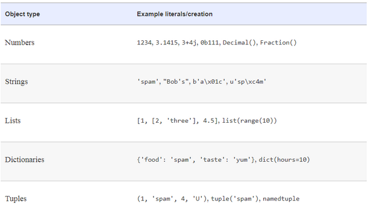

```{r setup, include=FALSE}
knitr::opts_chunk$set(echo = TRUE , message = FALSE , warning = FALSE , 
                      reticulate.repl.quiet = TRUE , error=TRUE)
```

# Basics

## Program Structure

Python is a programming language.
Like other languages, it gives us a way to communicate ideas.
In the case of a programming language, these ideas are "commands" that people use to communicate with a computer!

We convey our commands to the computer by writing them in a text file using a programming language.
These files are called programs.
Running a program means telling a computer to read the text file, translate it to the set of operations that it understands, and perform those actions.

Python programs can be decomposed into modules, statements , expressions and objects as follows:-

1.  Programs are decomposed of modules

2.  Modules contain statements

3.  Statements contain expressions

4.  Expressions create and process objects

## Comments

Text written in a program but not run by the computer is called a comment.
Python interprets anything after a **'#'** as a comment.

Comments can:

-   Provide context for why something is written the way it is

-   Help other people reading the code understand it faster

-   Ignore a line of code and see how a program will run without it

```{python}
# This is a program that prints the name of the user with single line comment
user = "Name"
print("Hello " + user + "!!")
```

## Print

In Python, the **print()** function is used to tell a computer to talk.
The message to be printed should be surrounded by quotes:

```{python}
# from Mary Shelley's Frankenstein
print("There is something at work in my soul, which I do not understand.")
```

In the above example, we direct our program to print() an excerpt from a notable book.The printed words that appear as a result of the print() function are referred to as **output**

Quotes are not always necessary inside of a print() function.
They are only needed when the input value of the function is a string, like "hello".
The print() functions can be used to output many other values in Python, such as the ones listed below

```{python}
print(10) 
print(False) 
print(["adam", "betty"]) 
```

Using the structure below you can tell python program to go to next line after printing something using print()

**Case 1 : print('line1 \\n\\nline3') : You can use \\n in your string to jump to a new line**

```{python}
print("My Name Is\n\nRavi")
```

**Case 2 : print('line1') ; print() ; print('line3')**

```{python}
print("My Name Is")
print()
print("Ravi")
```

## Variables

Programming languages offer a method of storing data for reuse.

If there is a greeting we want to present, a date we need to reuse, or a user ID we need to remember we can create a variable which can store a value.\

**In Python, we assign variables by using the equals sign (=).**

***Variables can't have spaces or symbols in their names other than an underscore (*****).**

**Variables can't begin with numbers but they can have numbers after the first letter (e.g., cool_variable_5 is OK).**

In the example below , we store the message "Hello there" in a variable called *message_string.*

```{python}
message_string = "Hello there"
# Prints "Hello there"
print(message_string)
```

Below, we create the variable message_string, assign a welcome message, and print the greeting.After we greet the user, we want to wish them goodbye.We then update message_string to a departure message and print that out.

```{python}
# Greeting
message_string = "Hello there"
print(message_string)

# Farewell
message_string = "Hasta la vista"
print(message_string)
```

# Built-in Types

We usually use Built-in Types because they are better off than implementing on our own.
Here, are some of the reasons:

1.  They make program easy to write

2.  They are components of extensions

3.  They are often more efficient than custom data structures

4.  They are a standard part of the language

{width="503"}

## Numbers

Numbers are object types used to find out e.g. the bank balance, distance to Mars, number of visitors on your website.....

Python supports the numeric types(integer and floating point) as well as literals for creating numbers and expressions for processing them.

An **integer, or int**, is a whole number.
It has no decimal point , contains all counting numbers +ve and -ve (1,2,-1,-2..) & the number 0.\

*If you were counting the number of people in a room, the number of jellybeans in a jar, or the number of keys on a keyboard you would likely use an integer.*

A **floating-point number, or a float**, is a decimal number.
It can be used to represent fractional quantities as well as precise measurements.\

*If you were measuring the length of your bedroom wall, calculating the average test score of a seventh-grade class, or storing a baseball player's batting average for the 1998 season you would likely use a float.*

**Numbers can be assigned to variables or used literally in a program**

Floating-point numbers can behave in some unexpected ways due to how computers store them.
For more information on floating-point numbers refer "<https://docs.python.org/3/tutorial/floatingpoint.html>".

```{python}
# using the int data type
i = 100
print(i)
```

```{python}
# using float data type
f = 12.3
print(f ) 
```

We use the "type()" method on the variable to ascertain the data type

```{python}
print(type(i))
print(type(f))
```

**Class task : Initialize g = 2 but I need type(f) output to be a float**

```{python}
g = 2.0
print(g)
print(type(g))
```

## Expression Operators

The most fundamental tool that processes numbers is expression : a combination of numbers (or other objects) and operators that computes a value when executed by Python.
For instance, to add two numbers X and Y you would say X + Y, which tells Python to apply + operator to values named X and Y.

Consider an expression in the form of A \* B + C, instead of coding in this form if we evaluate expression in desired order:-

1.  A \* (B + C)

2.  (A \* B) + C

In first case, '+' is first applied to B and C because the subexpression is enclosed in parantheses.

In Second case, '\*' is first applied to A and B because the subexpression is enclosed in parantheses.

**Class task :- What is the value of the expression "6 x (7 + 9)" and "6 x 7 + 9" in Python?**

```{python}
a = 6*(7+9)
print(a)

b = 6 * 7 + 9
print(b)
```

## Lists

Lists are Python's most flexible ordered collection of object type.
Unlike strings, lists can contain any sort of object: numbers, strings and even other lists.
Also unlike strings , lists may be changed in-place by assingment to offset and slices, list method calls(extend,append...), deletion statements (remove, pop)- they are mutable objects

### Create a list

Lists are created by specifying the elements within \[ \].A list begins and ends with square brackets (\[ and \]).Each item is separated by a comma (,)

Let us create a list of cities

```{python}
# List of Cities
cities = ['Mumbai', 'Bangalore', 'Hyderabad', 'Chennai', 'Delhi']
print(cities)
print(type(cities))
```

### Operation : Length of a list : len()

Often, we'll need to find the number of items in a list, usually called its length.We can do this using the function **len()**.When we apply len to a list, we get the number of elements in that list

```{python}
# length of cities list
len(cities)
```

### Operation : Selecting List Elements (index)

Python lists are **zero-indexed**.
This means that the first element in a list has index 0, rather than 1.We can select a single element from a list by using square brackets (\[ \]) and the index of the list item.For example, if we wanted to select the third element from the list, we'd use list\[2\]

```{python}
# Indexing and Slicing a list( Python index starts from 0)
cities[1]
```

We can use the index -1 to select the last item of a list, even when we don't know how many elements are in a list

```{python}
# Indexing last element of a list
cities[-1]
```

### Operation : Selecting specific range of elements

**Creating a selection from a list is called slicing.**

Suppose we have a list of letters: 'a' through 'g'and we want to select from b through f.

We can do this by specifying startindex , end index and steps in the list arguments

**startindex** - index of the first element that we want to include in our selection.

**endindex** - index of one more than the last index that we want to include.
*The end index of the selection is always one more than the last index that we want to include* **steps** is the incremental steps we want to select

```{python}
# select elements upto 2nd column
cities[0:3]
```

```{python}
# print cities list
print(cities)

# select the 1st and 3rd elements of the list
cities[0:4:2]

"""
start from 1st and go upto 4th in steps of 2
exclude 4th element
"""
```

### Operation : Append & Extend

We can add a **single element** to a list using .append().When we use .append() on a list that already has elements, the new element is added to the **end of the list**.It's important to remember that .append() comes after the list.
This is different from functions like print, which come before.\

*The append() function in Python can only add one item at a time to a list. In order to add more than one item, you call the append() function multiple times.Alternatively you can apply the .extend(\[\]) method to add multiple elements to the list*

Let us add "Pondichery" to our list of cities

```{python}
# add Pondichery
cities.append('Pondichery')
print(cities)
```

Let us add : Pune , Noida and Gurugram to our list of cities using extend method

```{python}
# add Pune , Noida , Gurugram
cities.extend(["Pune" , "Noida" , "Gurugram"])
print(cities)
```

| **append()**                                                             | **extend()**                                                                                 |
|--------------------------------------------------------------------------|----------------------------------------------------------------------------------------------|
| **The element passed as an argument is appended to the end of the list** | **Each element of the iterable passed as an argument gets appended to the end of the list.** |
| **Length of the list increases by 1**                                    | **Length of the list increases by the number of elements in the iterable.**                  |
